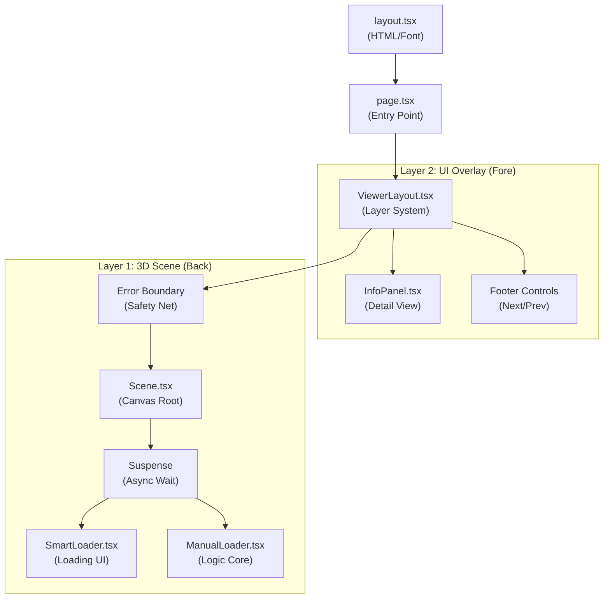
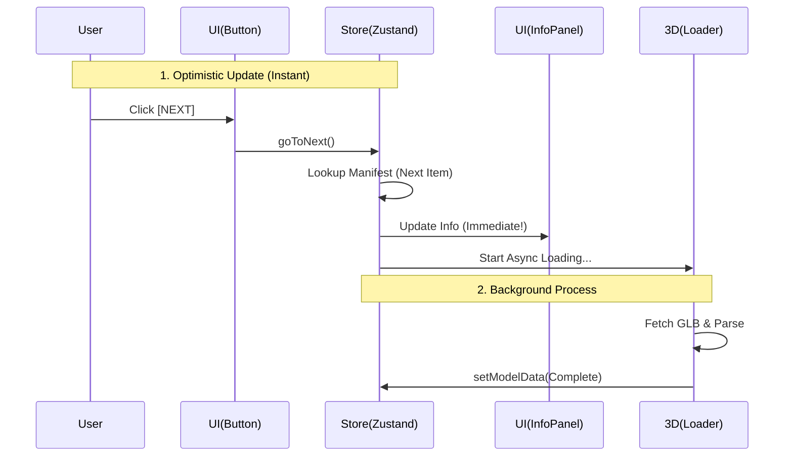

# System Map: Project Last-Stand

**Date:** 2026-01-31
**Version:** Phase 3.5

プロジェクトの全体像（ファイル構成、コンポーネント階層、データの流れ）を可視化したドキュメントです。
迷子になった時はここを参照してください。

---

## 1. Component Hierarchy (階層構造)

「どのファイルがどこに含まれているか」の地図です。
大きく **「静的な2Dレイアウト」** と **「動的な3Dシーン」** に分かれています。



### Key Files Overview

| ファイル名            | 分類     | 役割 (Responsibility)                                                                         |
| :-------------------- | :------- | :-------------------------------------------------------------------------------------------- |
| **page.tsx**          | Page     | アプリの入り口。`Scene` の動的読み込みとエラースイッチ (`ErrorBoundary`) を設置する。         |
| **ViewerLayout.tsx**  | Layout   | 画面構成の司令塔。「前面のUI」と「背景の3D」を重ね合わせる (Z-Index管理)。                    |
| **InfoPanel.tsx**     | UI       | 右上の情報パネル。Storeからデータを受け取り表示する「受信者」。                               |
| **Scene.tsx**         | 3D       | 3D世界の創造主。照明 (`Lights`) やカメラ、環境設定を行う。                                    |
| **ManualLoader.tsx**  | 3D/Logic | **最重要ファイル**。GLTFのロード、解析、アニメーション、Storeへのデータ送信を行う「心臓部」。 |
| **SmartLoader.tsx**   | UI       | `ManualLoader` が作業中の間だけ表示される待機画面。Anti-Flicker機能付き。                     |
| **asset-manifest.ts** | Data     | アプリ内の全アセット情報（名前、キャプション等）を定義する「台帳」。Storeの初期値。           |

---

## 2. Data Flow (データの流れ)

「3Dモデルの情報」がどうやって「2Dパネル」に届くのか？
**Zustand (store.ts)** を介した一方通行のデータの流れです。



### State Management (`src/lib/store.ts`)

このプロジェクトの "脳ミソ" です。
以下の情報をグローバルに保持しています。

1. **`targetPath`:** 今何を表示すべきか？ (Input)
   - 例: `"/models/radio.glb"`
2. **`currentModel`:** 今表示しているものの詳細データ (Output)
   - 例: `{ name: "Radio", quote: "...", techSpecs: {...} }`
3. **`isLoaded`:** ロードが終わっているか？ (Status)

---

## 3. Directory Structure (配置図)

```txt
src/
├── app/
│   ├── components/
│   │   ├── canvas/       # 3D関連 (Canvasの中で動くもの)
│   │   │   ├── ManualLoader.tsx
│   │   │   └── Scene.tsx
│   │   ├── layout/       # レイアウト関連
│   │   │   └── ViewerLayout.tsx
│   │   └── ui/           # 2D UIパーツ
│   │       ├── InfoPanel.tsx
│   │       └── SmartLoader.tsx
│   ├── layout.tsx        # アプリ全体の枠 (Font等)
│   └── page.tsx          # トップページ (構成定義)
└── lib/
    ├── store.ts          # データセンター (Zustand)
    ├── asset-manifest.ts # アセット台帳 (Static Data)
    └── utils.ts          # 便利ツール (Tailwind merge)
```
