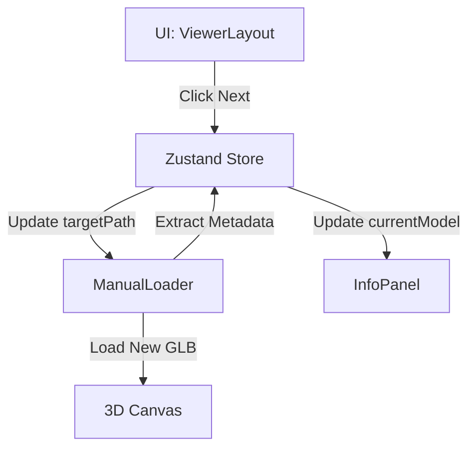

# Mission: Navigator 実装 (モデル切替システム)

**「ポートフォリオ」とは、複数の作品を見せる場所です。**
現在は `React_Logo.glb` しか表示できませんが、これをボタン操作で切り替えられるようにします。

## 1. 戦略 (Strategy)

React/Next.js の強みである **「State Management (状態管理)」** を活用します。
`ManualLoader` に「ファイルパス」を直接書くのではなく、ZustandのStoreから「現在のパス」を受け取るように変更します。

**Architecture:**



## 2. 実装ステップ

### Step 1: Storeの拡張 (Modify)

既存の `src/lib/store.ts` を編集し、ローダーを制御するための「パス情報」を追加します。

**File:** `src/lib/store.ts`

```typescript
// ... (既存の ArchiveItem 定義はそのまま)

// ストアの定義 (AppState) に追記
interface AppState {
  // 既存の状態
  isLoaded: boolean;
  currentModel: ArchiveItem | null; // パネル表示用データ

  // [NEW] ローダー制御用パス
  targetPath: string; 
  setTargetPath: (path: string) => void;
  
  // (既存のアクション...)
  setModelData: (data: ArchiveItem) => void;
  resetModelData: () => void;
}

// ストア作成部分 (create) に追記
export const useStore = create<AppState>((set) => ({
  // ... (既存の初期値)
  
  // [NEW] 初期パス (React Logo)
  targetPath: "/models/React_Logo.glb",
  setTargetPath: (path) => set({ targetPath: path }),

  // ... (既存の実装)
}));
```

### Step 2: Loaderの動的化 (Modify)

`ManualLoader.tsx` が Store の `targetPath` を見るように書き換えます。
**ここが最重要です。パスが変わると React Three Fiber は自動的に再ロードを行います。**

**File:** `app/components/ManualLoader.tsx`

```tsx
// ...
export default function ManualLoader() {
  // [NEW] Storeからターゲットパスを取得
  const targetPath = useStore((state) => state.targetPath); 

  const gltf = useLoader(GLTFLoader,
    targetPath, // [MODIFY] 固定文字列 "/models/..." を変数に変更
    (Loader) => {
      // ... (Draco設定はそのまま)
    }
  );

  // ...
}
```

### Step 3: Navigator UI (Implement)

`ViewerLayout.tsx` のボタンでパスを切り替えられるようにします（仮実装）。

**File:** `app/components/ViewerLayout.tsx`

```tsx
// ...
import { useStore } from "@/lib/store"; // Import

export default function ViewerLayout({ children }: ViewerLayoutProps) {
  // [NEW] アクションを取得
  const setTargetPath = useStore((state) => state.setTargetPath);

  // [TEST] 切り替えテスト用関数
  const handleNext = () => {
    // 実際はリストから次のものを取りますが、まずは動くかテスト
    console.log("Switching to Radio...");
    // ※ まだファイルがないので404になりますが、動作確認としてはOKです
    setTargetPath("/models/radio.glb"); 
  };
  
  return (
     // ...
     // [MODIFY] ボタンにイベントを設定
     <button onClick={handleNext} className={cn(...) /* 既存のクラス */}>
        [ <span className="text-cyan-500">NEXT</span> ]
     </button>
     // ...
  );
}
```

---

### 実践

1. `src/lib/store.ts` に `targetPath` を追加。
2. `ManualLoader.tsx` の `useLoader` 第一引数を `targetPath` に変更。
3. `ViewerLayout.tsx` のボタンで `console.log` が出るか、あるいは（ファイルがないため）エラーが出るか確認。

エラー（404 Not Found）が出れば、**「正しく新しいパスを読みに行こうとした」** 証拠なので成功です！
