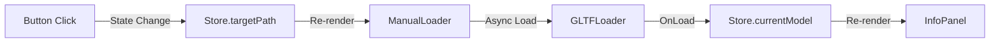
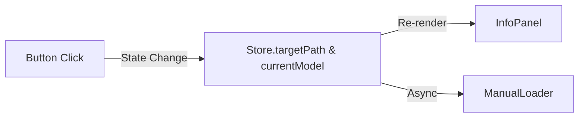

# Tech Report: Optimistic UI & Error Handling

**Date:** 2026-02-12
**Tag:** Concept Translation, Architecture

このドキュメントは、今回のデプロイバグ修正で採用した「楽観的UI更新」と「エラーハンドリング」の設計思想を解説する学習資料です。

## 1. 楽観的UI更新 (Optimistic UI Update)

### 1.1 概念翻訳 (Concept Translation)

**Unity/VRChatの世界:**
> あなたはFPSゲームを作っています。「武器切り替えボタン」を押したとき、あなたならどう実装しますか？

- **Bad Pattern:** `Instantiate` (生成) が完了し、`Start()` が呼ばれるまで、画面上の武器アイコンを変えない。
  - **結果:** プレイヤーは「あれ？ボタン押したっけ？」と不安になり、連打してしまう。ネットワークが遅いと武器もアイコンも変わらない。
- **Good Pattern:** ボタンを押した瞬間、**まだモデルがロードされていなくても**、画面上の武器アイコンと弾数表示を即座に切り替える。その裏で非同期にモデルをロードする。
  - **結果:** プレイヤーは「サクサク動く」と感じる。もしロードに失敗したら、その時初めてエラーを出すか、元のアイコンに戻す。

**Web開発の世界:**
これが「楽観的UI更新」です。「サーバー（3Dローダー）は成功するだろう」と楽観的に考え、先にUIを更新してしまう手法です。

### 1.2 構造の解剖 (Anatomy)

今回の修正前 (`Bad Pattern`) のデータフロー：



UI更新が一番最後のステップに依存しているため、途中でコケるとUIが死にます。

修正後 (`Good Pattern`) のデータフロー：



ユーザーアクション直後にUIが更新され、Loaderは並列で動きます。これにより「体感速度」が劇的に向上します。

## 2. エラーバウンダリ (Error Boundary)

### 2.1 概念翻訳

**Unityの世界:**
`Try-Catch` ブロックで `Instantiate` を囲み、例外が発生してもゲーム全体をクラッシュさせず、エラーログ用の Canvas を表示する処理です。

### 2.2 Re-styling

修正前は、エラーログの `div` が `z-index: 0` の `ViewCanvas` 内部に無造作に置かれていたため、`z-index: 10` のヘッダーUIの下に潜り込んだり、3D空間の変な位置に表示されたりしていました。

修正では、以下のようにCSSを適用し、**「警告ウィンドウ」** として振る舞うようにしました。

```css
position: absolute;
top: 50%;
left: 50%;
transform: translate(-50%, -50%); /* 完全中央寄せ */
z-index: 0; /* ViewCanvas内だが、最前面に来るように */
background: rgba(0,0,0, 0.8);
border: 1px solid red;
```

## 3. 重要ポイント

- **Single Source of Truth (SSOT):** UIデータは「Manifestファイル」を正としました。3Dモデルファイル内のメタデータ (`userData`) は「補助」であり、それに依存してはいけません。
- **UX First:** 技術的に正しいロード順序よりも、ユーザーが「快適だ」と感じる反応速度を優先する設計（Optimistic UI）が、現代のフロントエンド開発の標準です。
